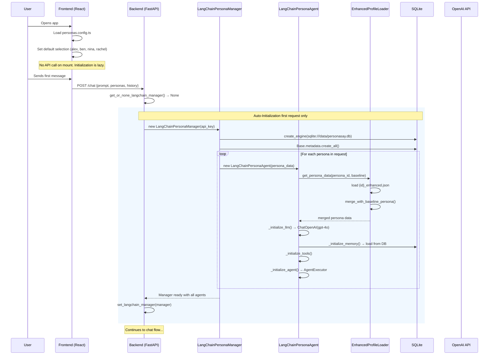
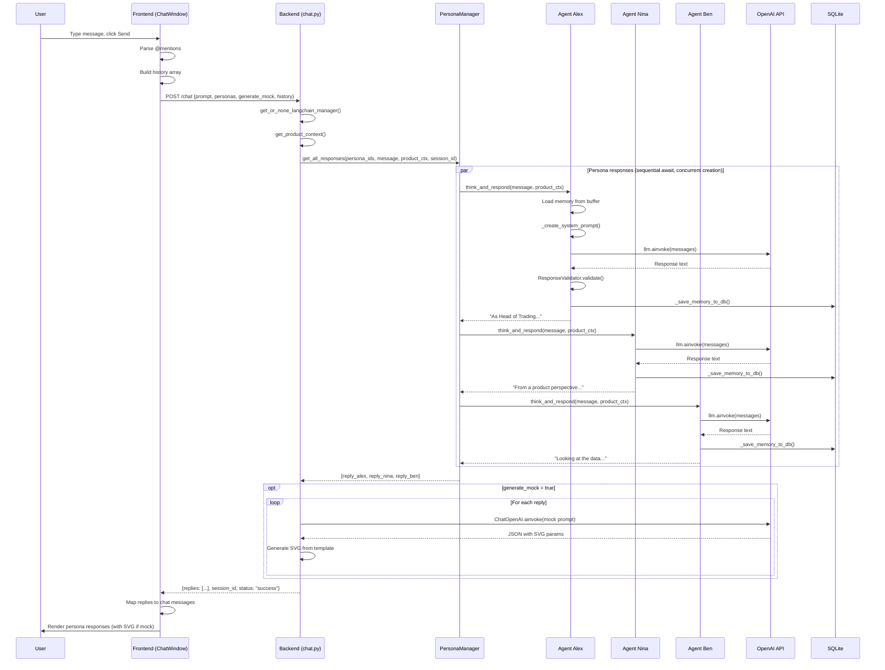
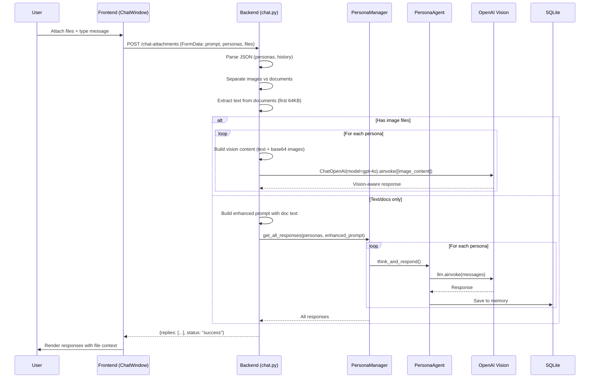
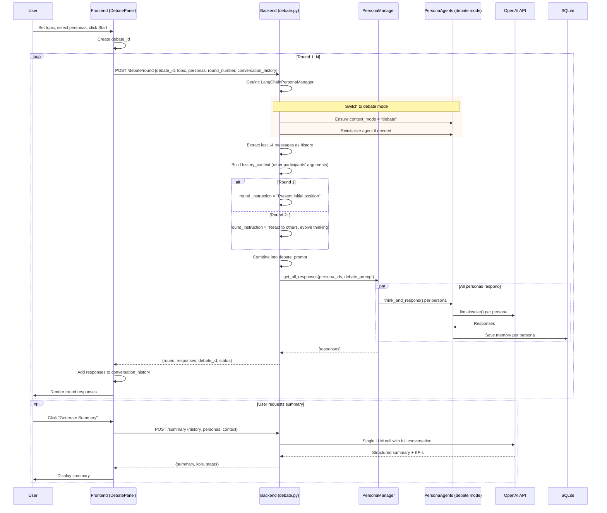
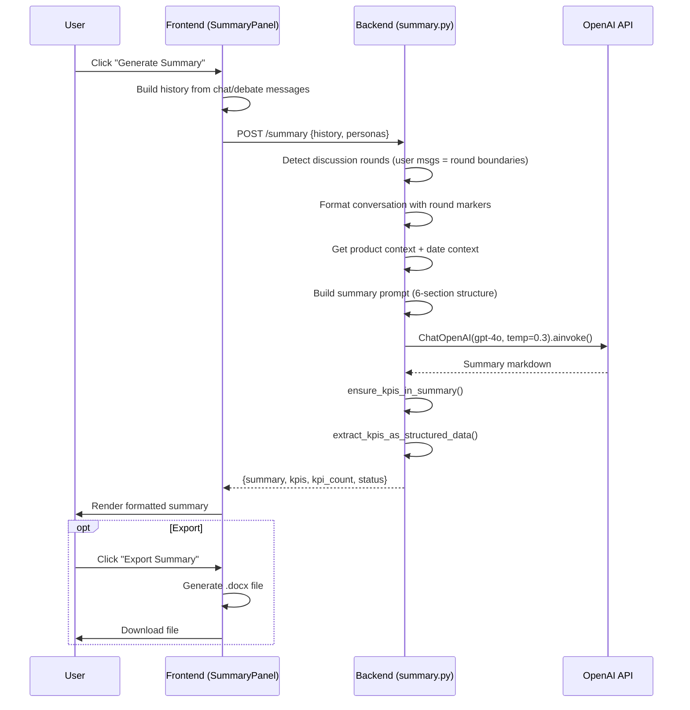
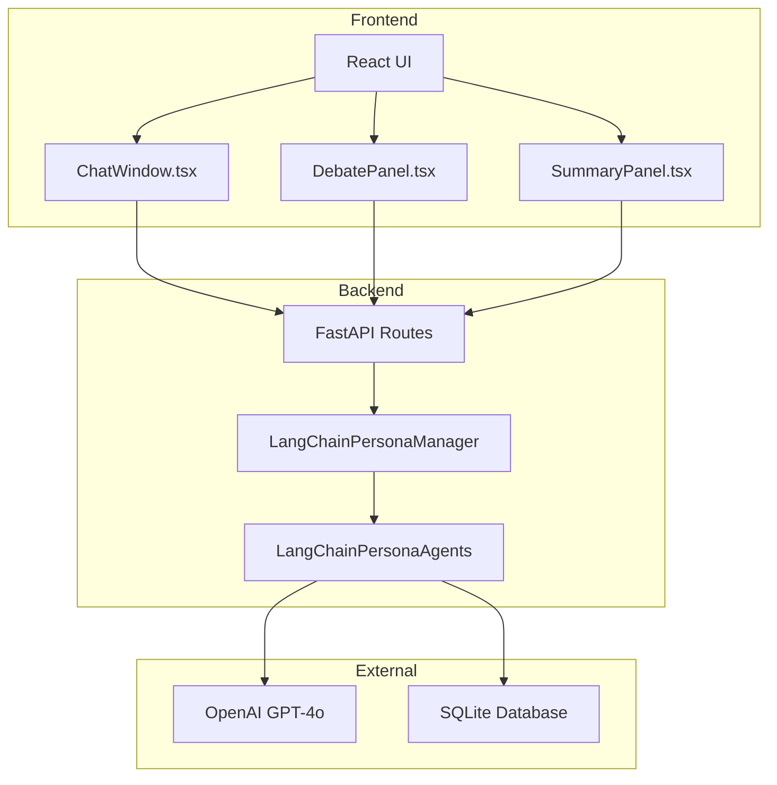

# PersonaSay Sequence Diagrams

This document provides complete sequence diagrams for all major flows in the PersonaSay application.

---

## Table of Contents

1. [Initialization Flow](#1-initialization-flow)
2. [Chat Flow](#2-chat-flow)
3. [Chat with Attachments Flow](#3-chat-with-attachments-flow)
4. [Debate Flow](#4-debate-flow)
5. [Summary Flow](#5-summary-flow)

---

## 1. Initialization Flow

**Lazy initialization triggered by first chat request**



**Key Points:**
- No initialization on server startup - fully lazy
- First `/chat` request triggers auto-initialization
- Each persona loads from `{id}_enhanced.json` and merges with baseline
- LangChain agents created with memory, tools, and AgentExecutor
- Memory is loaded from database (if exists from previous sessions)

---

## 2. Chat Flow

**Standard conversation with personas**



**Key Points:**
- @Mentions are parsed by frontend to filter active personas
- Personas respond in parallel (concurrent async tasks)
- Each response is validated and saved to database
- Optional mock generation creates SVG visualizations
- All conversation history persists in SQLite

---

## 3. Chat with Attachments Flow

**Chat with image or document attachments**



**Key Points:**
- Supports images (PNG, JPG, WEBP) and documents (PDF, DOCX, TXT)
- Images use GPT-4o Vision for multimodal understanding
- Documents have text extracted and appended to prompt
- File attachments are processed per request (not persisted)

---

## 4. Debate Flow

**Multi-round structured debate between personas**



**Key Points:**
- Debate mode changes persona system prompts for argumentative responses
- Each round includes context from previous rounds (last 14 messages)
- Round 1: Initial positions, Round 2+: React and evolve
- Personas engage with each other's arguments
- Optional summary generation at end

---

## 5. Summary Flow

**AI-powered conversation summary with KPI extraction**



**Key Points:**
- Automatically detects discussion rounds from conversation history
- Generates 6-section structured summary:
  1. Executive Summary
  2. Key Discussion Themes
  3. Consensus Points
  4. Areas of Disagreement
  5. Action Items & Recommendations
  6. KPIs Identified
- Extracts KPIs as structured data (JSON)
- Supports .docx export for sharing

---

## Architecture Overview

### System Components



### Data Flow Patterns

**Request-Response Pattern:**
- All frontend-backend communication is synchronous HTTP (REST)
- No WebSockets, SSE, or webhooks currently implemented
- Each request waits for full response before proceeding

**Persona Processing:**
- Personas process requests in parallel (concurrent async tasks)
- Each persona has independent memory and state
- All personas share the same database but have separate memory buffers

**Memory Persistence:**
- Every chat exchange saved to SQLite (`persona_memories` table)
- Memory loaded on agent initialization
- ConversationBufferWindowMemory keeps last 50 exchanges in memory

---

## API Endpoints Reference

### Chat Endpoints
- `POST /chat` - Standard chat with personas
- `POST /chat-attachments` - Chat with file attachments

### Debate Endpoints
- `POST /debate/round` - Execute single debate round
- `POST /debate/round-with-attachments` - Debate with attachments
- `POST /langchain/debate` - Legacy multi-round debate (not used)

### Summary Endpoints
- `POST /summary` - Generate conversation summary

### System Endpoints
- `GET /health` - Health check
- `POST /langchain/initialize` - Initialize personas (optional)
- `GET /langchain/stats` - System statistics
- `GET /product/config` - Get product configuration

### Memory Endpoints
- `GET /langchain/memory/{persona_id}` - Get persona memory
- `GET /langchain/conversation/{session_id}` - Get conversation history

---

## Implementation Notes

### Lazy Initialization
The system uses lazy initialization - no personas are loaded until the first chat request. This reduces startup time and resource usage.

### Parallel Processing
Personas respond concurrently using Python's `asyncio`. Tasks are created together but awaited sequentially in the current implementation. For true parallel execution, use `asyncio.gather()`.

### Database Schema
```sql
CREATE TABLE persona_memories (
    id INTEGER PRIMARY KEY,
    persona_id TEXT NOT NULL,
    session_id TEXT NOT NULL,
    message_type TEXT NOT NULL,  -- 'user' or 'assistant'
    content TEXT NOT NULL,
    timestamp DATETIME DEFAULT CURRENT_TIMESTAMP
);
```

### Response Format
All API responses follow this structure:
```json
{
    "replies": [...],
    "session_id": "uuid",
    "framework": "langchain",
    "status": "success"
}
```

---

## Future Enhancement Opportunities

Based on these flows, potential improvements include:

1. **True Parallel Execution**: Use `asyncio.gather()` for concurrent persona responses
2. **WebSocket Support**: Real-time streaming responses instead of waiting for all personas
3. **Webhook Events**: Fire events for external integrations (e.g., n8n, Zapier)
4. **Caching**: Redis cache for product context and persona profiles
5. **Batch Processing**: Process multiple prompts in a single request
6. **Agent-to-Agent Communication**: Direct persona interactions without user mediation

---

*Generated: 2026-02-06*
*PersonaSay Version: LangChain 0.3+*
